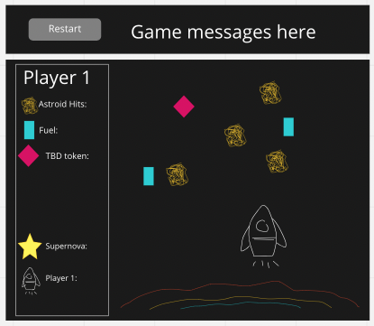
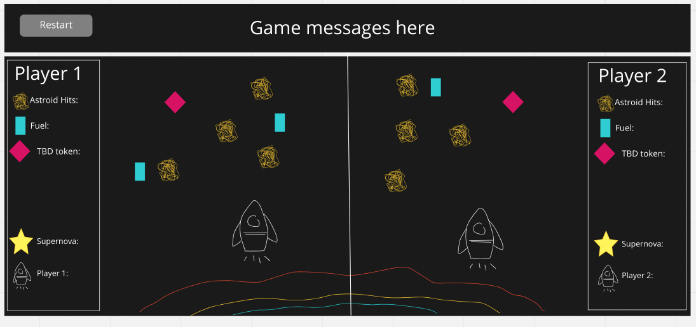

# Escape the Supernova

You are in a spaceship and a star is going supernova! You are in a race against time to escape obliteration from the impact of the supernova. 

The supernova is always growing but as you collect fuel packets, it propels you farther into space, and farther away from the deadly supernova. 

Unfortunately, space is cluttered with astroids that damage your spaceship and effect your propulsion. 

Win by escaping distruction!

# Mockup
One player version

Two player version

# Tech Being Used
- HTML
- CSS
- JavaScript

# MVP Checklist
- Basic gameboard layout
- Section for Player
- Section for displaying win/lose status
- On screen tracker for resources
- Keyboard controls for moving the spaceship
- Detection and subsequent action when collision between spaceship and an object occurs (astroid, fuel packet, supernova)
- Ability to reset the game

# Stretch Goals
- Make a landing page with instructions and a way to initiate the game (the instructions may display as an opening crawl)
- Refine the graphics
    - make the background look more like outerspace
        - perhaps it could mimic twinkling stars againsta a black background
    - render the objects in more detail (supernova, fuel pack, astroid, TBD token, spaceship)
- Add micro-movements to items
    - make the spaceship shake when it gets hit by an astroid
- Implement additional tokens (identified as 'TBD token' in the mockup) that fall from space and have additional effects on the game and perhaps even on the other player
- Multi-player game: 
    - make the game be independent for Player 1 and Player 2, while still detecting a winner
    - provide the ability to keep track of games played and how many games were won by each Player

# Potential Roadblocks
- Getting all the pieces to work together as expected along with it being multi-player
- Testing different scenarios